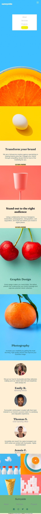
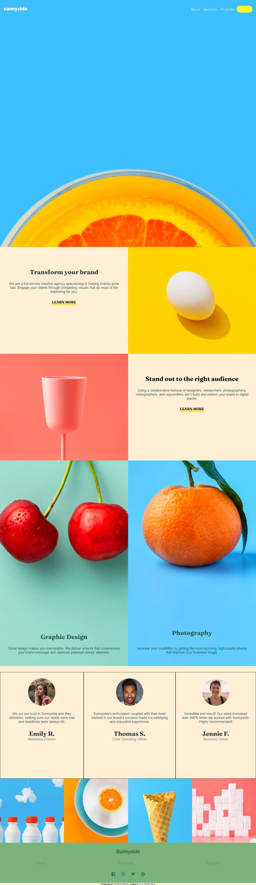

# Frontend Mentor - Sunnyside agency landing page solution

This is a project to work on my CSS Grid skills and Flex, with a little Javascript for my navigation.

## Table of contents

- [Overview](#overview)
  - [The challenge](#the-challenge)
  - [Screenshot](#screenshot)
  - [Links](#links)
- [My process](#my-process)
  - [Built with](#built-with)
  - [What I learned](#what-i-learned)
  - [Continued development](#continued-development)
  - [Useful resources](#useful-resources)
- [Author](#author)
- [Acknowledgments](#acknowledgments)


## Overview

### The challenge

Users should be able to:

- View the optimal layout for the site depending on their device's screen size
- See hover states for all interactive elements on the page

### Screenshot
I added some Screenshots.





### Links

- Live Site URL: [Add live site URL here](https://chrysbim.com)

## My process

### Built with

- Semantic HTML5 markup
- CSS custom properties
- Flexbox
- CSS Grid
- Mobile-first workflow


### What I learned
I have learned how to properly implement responsive layout using CSS Grid, and a little bit of FlexBox on my Navigation.

To see how you can add code snippets, see below:

```html
 <nav>
      <ul id="primary-navigation" class="primary-navigation flex" data-visible= false>
        <li><a class="ff-sans-normal" href="#">About</a></li>
        <li><a class="ff-sans-normal" href="#">Services</a></li>
        <li><a class="ff-sans-normal" href="#">Projects</a></li>
        <li><a class="ff-sans-normal contact" href="#">Contact</a></li>
      </ul>
    </nav>
```

```css
 .mobile-nav-toggle{
        display: block;
        position: absolute;
        z-index: 2000;
        right: 0rem;
        top: 0rem;
        background: transparent;
        background-image: url(./images/icon-hamburger.svg);
        background-repeat: no-repeat;
        aspect-ratio: 1;
        margin: 1.25rem;
        width: 2rem;
        border: 0;
    }
```

```js
var menuButton= document.getElementsByClassName('mobile-nav-toggle')[0];
var PrimaryNav= document.getElementsByClassName('primary-navigation')[0]
console.log(menuButton)
menuButton.addEventListener('click',function(){
    console.log('clicked')
    var visibility=  PrimaryNav.getAttribute('data-visible');
    console.log(visibility)
    if(visibility === 'false'){
        PrimaryNav.setAttribute("data-visible",true);
        PrimaryNav.setAttribute("aria-expanded", true)
         PrimaryNav.style.transform='none'
    } else{
        PrimaryNav.setAttribute("data-visible",false);
        PrimaryNav.setAttribute("aria-expanded", false)
         PrimaryNav.style.transform='translateX(300%) rotate(360deg) scale(2)'
         PrimaryNav.style.transition= '2s ease-in-out'
    }

    console.log(PrimaryNav.getAttribute('aria-expanded'))
    
})
```


### Continued development

These are the areas where i will have to focus on in the future projects.
- How to better center background images
-How to properly use positions properties(Absolute, Fixed)


### Useful resources

- [Example resource 1](https://www.youtube.com/watch?v=rg7Fvvl3taU) - This helped me with CSS-Grid. I really liked this pattern and will use it going forward.


## Author

- Website - [Chrys Bimokono](https://www.chrysbim.com)
- Frontend Mentor - [@yourusername](https://www.frontendmentor.io/profile/yourusername)
- Twitter - [@Enockbim](https://twitter.com/home)

